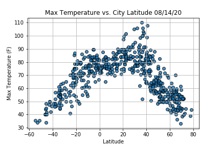
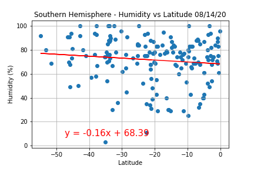

# Weather Analysis
### Project Descripiton
In this project I have analyzed different weather patterns, (temperature, humidity, cloudiness, and wind speed), and how they are affected by distance from the equator i.e. latitude. Additionally, I created a jupyter notebook that will find hotels in cities that match a user's ideal vacation weather (in my case between 70 and 80 degree Fahrenheit, wind speed less than 10 mph, and zero cloudiness). I then displayed the results on a map using the gmaps widget.

### Methodology

#### WeatherPy
I first created a uniformly random list of 1500 latitudes and longitudes. I then got the nearest city to each pair of coordinates using the [Citypy library](https://pypi.org/project/citipy/), ignoring any duplicates. Next I  made API calls to the [OpenWeather API](https://openweathermap.org/api) for each city to get their latitude, longitude, max temperature, humidity, and cloudiness. I stored all information gathered into a dataframe, and saved it as a CSV for later use. I then plotted the relevant data versus latitude to better analyze it.

#### VacationPy
To find hotels in cities with ideal weather conditions I first loaded the CSV city data created in the WeatherPy notebook into a dataframe. Then using the gmaps widget I created a heatmap of humidity around the world to better visualize weather conditions around the world. Next I filtered the cities based on my ideal vacation conditions into a new dataframe and removed weather data from it. I then looped through the new dataframe and made an API call to Google Places to find a hotels in each city. I stored the first hotel for each city in a list and appeneded it to the dataframe. I filtered out any cities that did not return a hotel.

### Analysis
- #### Max Temperature

Weather becomes becomes warmer as one approaches the equator (Latitude 0 degrees). Interestingly, the northern hemisphere, (latitude greater than 0 degrees), is warmer than the southern hemisphere (latitude less than 0 degrees). This may be due to the tilt of the earth. 

    
The linear regression of the northern hemisphere has an r-squared value of  0.51 and the southern hemisphere has an r-squared value of 0.69. This means that even though there is a correlation between max temperature and distance from the equator, the relationship is not linear.

- #### Humidity

   
There is no strong relationship between humidity and distance from the equator. It is interesting that the majority of cities in both the norhtern and southern hemisphere fall between 60 - 100% humidity. It is also interesting that there seem to be more cities in the northern hemisphere with humidity levels under 20% than in the southern hemisphere. This may due to there being more cities in the northern hemisphere in this sample set, so more analysis with a larger sample set would be needed to confirm this.

- #### Cloudiness

   
There is no strong relationship between cloudiness and latitude. It is interesting that there are bands of cities at 0,20,40,75, and 100% cloudiness in the northern hemisphere, where as there is only a band of cities at 0% cloudiness in the southern hemisphere.

- #### Wind Speed

   
There is no strong relationship between wind speed and latitude. The highest density of cities fall between 0-10 mph.  

### Try It Yourself
