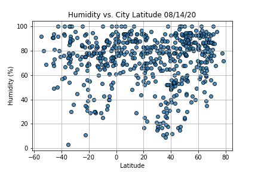
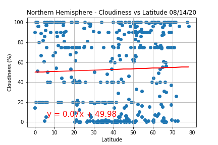
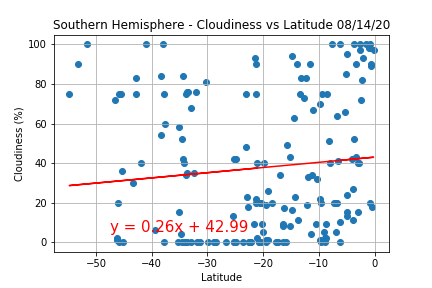
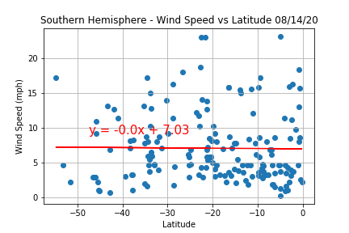

# Weather Analysis
* [Project Description](#project-description)  
* [Methodology](#methodology) 
* [Analysis](#analysis)  
* [Try It Yourself](#try-it-yourself)

### Project Description
In this project I have analyzed different weather patterns, (temperature, humidity, cloudiness, and wind speed), and how they are affected by distance from the equator i.e. latitude. Additionally, I created a jupyter notebook that will find hotels in cities that match a user's ideal vacation weather (in my case between 70 and 80 degree Fahrenheit, wind speed less than 10 mph, and zero cloudiness). I then displayed the results on a map using the gmaps widget.

### Methodology

#### WeatherPy
I first created a uniformly random list of 1500 latitudes and longitudes. I then got the nearest city to each pair of coordinates using the [Citypy library](https://pypi.org/project/citipy/), ignoring any duplicates. Next I  made API calls to the [OpenWeather API](https://openweathermap.org/api) for each city to get their latitude, longitude, max temperature, humidity, and cloudiness. I stored all information gathered into a dataframe, and saved it as a CSV for later use. I then plotted the relevant data versus latitude to better analyze it.

#### VacationPy
To find hotels in cities with ideal weather conditions I first loaded the CSV city data created in the WeatherPy notebook into a dataframe. Then using the gmaps widget I created a heatmap of humidity around the world to better visualize weather conditions around the world. Next I filtered the cities based on my ideal vacation conditions into a new dataframe and removed weather data from it. I then looped through the new dataframe and made an API call to Google Places to find a hotels in each city. I stored the first hotel for each city in a list and appeneded it to the dataframe. I filtered out any cities that did not return a hotel.

### Analysis
- #### Max Temperature


Weather becomes becomes warmer as one approaches the equator (Latitude 0 degrees). Interestingly, the northern hemisphere, (latitude greater than 0 degrees), is warmer than the southern hemisphere (latitude less than 0 degrees). This may be due to the tilt of the earth. 

    
The linear regression of the northern hemisphere has an r-squared value of  0.51 and the southern hemisphere has an r-squared value of 0.69. This means that even though there is a correlation between max temperature and distance from the equator, the relationship is not linear.

- #### Humidity


   
There is no strong relationship between humidity and distance from the equator. It is interesting that the majority of cities in both the norhtern and southern hemisphere fall between 60 - 100% humidity. It is also interesting that there seem to be more cities in the northern hemisphere with humidity levels under 20% than in the southern hemisphere. This may due to there being more cities in the northern hemisphere in this sample set, so more analysis with a larger sample set would be needed to confirm this.


- #### Cloudiness


   
There is no strong relationship between cloudiness and latitude. It is interesting that there are bands of cities at 0,20,40,75, and 100% cloudiness in the northern hemisphere, where as there is only a band of cities at 0% cloudiness in the southern hemisphere.


- #### Wind Speed


   
There is no strong relationship between wind speed and latitude. The highest density of cities fall between 0-10 mph.  
### Try It Yourself
Both programs are located in the Notebooks folder and were created in a Python 3.7.6 environment. In order to run them you need these additional libraries installed in your environment:
#### WeatherPy
* [Matplotlib](https://matplotlib.org/): `!pip install matplotlib`  
* [Pandas](https://pandas.pydata.org/): `!pip install pandas`
* [NumPy](https://numpy.org/): `!pip install numpy`
* [Requests](https://requests.readthedocs.io/en/master/): `!pip install requests`
* [SciPy](https://www.scipy.org/): `!pip install scipy`
* [Citipy](https://github.com/wingchen/citipy): `!pip install citipy` (Already in the notebook. Just uncomment if not already in your environment.)

#### VacationPy
* [Pandas](https://pandas.pydata.org/): `!pip install pandas`
* [Requests](https://requests.readthedocs.io/en/master/): `!pip install requests`
* [Gmaps](https://github.com/pbugnion/gmaps): `!pip install gmaps` (Already in the notebook. Just uncomment if not already in your environment.)

Additionally, you will need API keys for [OpenWeatherMaps](https://openweathermap.org) and [Google APIs](https://console.developers.google.com/) to use in WeatherPy and VacationPy respectively:
#### WeatherPy
You can get an API key for OpenWeatherMaps [here](https://openweathermap.org/price). The notebook is configured to limit the amount of API calls made to the amount allowed by the free tier which means it will take about six minutes to run on average. However, you can speed this up by purchasing a higher tier and adjusting the wait time in the code accordingly. Once you have signed up you will find you API key in your profile under API keys. Copy this key and paste it in place of `YOUR API KEY HERE` in the api_keys.py (located in the Notebooks folder):  
```
# OpenWeatherMap API Key   
weather_api_key = "YOUR API KEY HERE"
```
Once you have installed all required libraries and saved your API key, the WeatherPy notebook is ready to run.

#### VacationPy
In order to get a Google APIs key you will need to have a google account and set up a project with a billing account in the Google Developers Console. You can find instructions on how to do that and how to get an API key [here](https://developers.google.com/maps/documentation/embed/get-api-key). Although you will need to make a billing account, this notebook does not generate enough calls for you to be charged. If you are worried about being charged you can find instructions on how to set limits [here](https://cloud.google.com/apis/docs/capping-api-usage).  
Once you have your key paste it in place of `YOUR API KEY HERE` in the api_keys.py (located in the Notebooks folder):
```
# Google API key  
g_key = "YOUR API KEY HERE"
```
Once you have installed all required libraries and saved your API key, the VacationPy notebook is ready to run. It is recommended that you run the WeatherPy notebook before running the VacationPy notebook in order to have the most up-to-date weather information.
